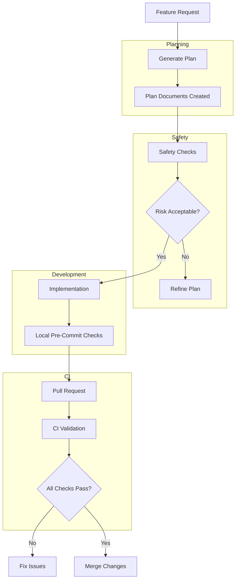
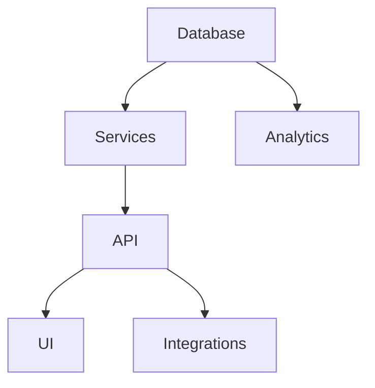

# AI Agent Engineering Framework

A lightweight governance framework for safely using AI coding agents in software projects.

This framework enables safe AI-assisted development by enforcing
planning, safety checks, and architecture-aware validation before code changes are merged.


The framework enforces a **plan-first workflow**, detects **collisions between concurrent work**, analyzes **architecture impact**, and prevents unsafe commits using **local hooks and CI checks**.

It is designed to work with:

- AI coding agents (ChatGPT, Codex, Claude Code, Cursor, Copilot)
- Multi-developer repositories
- Systems with database, API, service, and analytics layers

---
## Framework Overview



# Core Principles

The framework enforces the workflow:

PLAN → BACKLOG → SPRINT → SAFETY → IMPLEMENT → VALIDATE

Before code changes occur, a structured plan must exist and pass safety checks.

---

# What the Framework Provides

## Planning

Agents generate structured plans for work:

```
docs/<plan_name>/
    plan.yaml
    backlog.yaml
    sprint_plan.yaml
    risk_register.yaml
    dependency_map.yaml
    collision_detection.yaml
    progress.yaml
    handoff.yaml
```

---

## Safety Checks

Scripts validate:

- plan structure
- architecture impact
- regression risk
- execution order
- collisions with other work

---

## Architecture Awareness

The framework tracks system structure using:

```
docs/architecture/system_boundaries.yaml
docs/architecture/data_models.yaml
```

This allows the system to detect cross-layer changes such as:

Database → Services → API → UI

---

## Multi-Agent Coordination

The framework detects when multiple agents or developers work on overlapping areas and schedules execution phases accordingly.

---

## Commit Protection

Three layers of protection exist:

| Layer | Purpose |
|------|-------|
| Local machine | pre-commit validation |
| Pull request | CI workflow validation |
| Planning stage | plan validation scripts |

---

# Repository Structure

```
agent-engineering-framework
│
├─ AGENTS.md
├─ README.md
├─ requirements.txt
├─ .pre-commit-config.yaml
│
├─ scripts/
│
├─ docs/
│   ├─ architecture/
│   ├─ planning/
│   └─ safety/
│
└─ .github/workflows/
```

---

# Installation

Install dependencies:

```
pip install -r requirements.txt
```

Dependencies:

```
PyYAML
pre-commit
```

---

# Enable Local Commit Protection

Install git hooks:

```
pre-commit install
```

Now every commit runs safety checks automatically.

---

# Using the Framework in a Project

The framework is intended to be copied into existing projects.

Example project:

```
pricing-service/
```

Add the framework files:

```
pricing-service
│
├─ src/
├─ tests/
│
├─ AGENTS.md
├─ scripts/
└─ docs/
```

---

# Creating a New Plan

When implementing a feature, generate a plan:

```
python scripts/generate_plan.py "Implement pricing engine"
```

This creates:

```
docs/implement_pricing_engine/
```

Containing the planning documents.

Agents must complete and validate the plan before implementation.

---

# Running Validation

You can run checks manually:

```
python scripts/validate_plan.py docs
python scripts/compute_risk_score.py
python scripts/detect_collisions.py
python scripts/analyze_change_impact.py
```

---

# Architecture Diagram

Generate a visual architecture map:

```
python scripts/generate_architecture_diagram.py
```

Output:

```
docs/architecture/system_graph.mmd
```

This can be rendered directly in GitHub or VS Code.

---

# CI Integration

The repository includes a GitHub workflow:

```
.github/workflows/agent-multi-plan-guard.yml
```

This runs safety checks on pull requests.

---

# Typical Workflow

1. Feature request is created
2. Agent generates plan
3. Plan is reviewed
4. Safety checks run
5. Implementation begins
6. Pre-commit checks run locally
7. CI validates pull request
8. Changes are merged

---

# Example Feature Workflow

```
python scripts/generate_plan.py "Add pricing API"
```

Agent completes:

```
plan.yaml
backlog.yaml
sprint_plan.yaml
```

Safety checks run before coding.

---

# Recommended Usage Pattern

Use this repository as a **shared framework** and copy it into projects.

Alternatively you may use it as a **git submodule**.

Example:

```
git submodule add https://github.com/<org>/agent-engineering-framework
```

---

# When to Use This Framework

This framework is most useful for projects with:

- multiple developers
- AI coding agents
- database schema changes
- service architecture
- analytics pipelines
- ERP integrations

---

# Goals

The framework is designed to:

- reduce regressions
- detect architectural impacts early
- coordinate multiple agents safely
- enforce disciplined engineering practices

---
## Architecture Awareness



# License

Internal engineering tool.